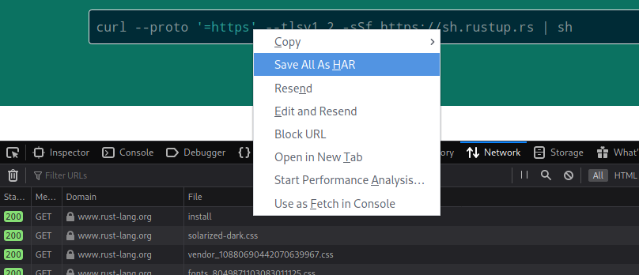
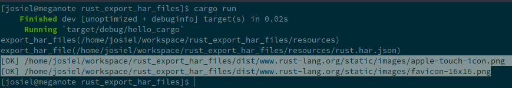

# Exportador de recursos de arquivos .HAR

## Objetivo do projeto
Praticar com a linguagem para adquirir familiaridade e internalizar os conhecimentos adquiridos com a mesma

## Objetivo do programa
Exportar os recursos de um arquivo *.har* para arquivos individuais no armazenamento local respeitando:

1. Manter a mesma estrutura de diretórios a começar pelo domínio
2. Criar um arquivo para recurso presente no arquivo .har
3. Nessa implementação somente foram considerados arquivos de imagem para serem exportados

## Requisitos
* [Rust](https://www.rust-lang.org/tools/install)

## Conhecimentos aplicados
* Manipulação de arquivos e diretórios
* Utilização de Expressões Regulares
* Parse de JSON usando biblioteca externa
* Match patterns
* Ownership

## Como funciona?
No [Firefox](https://firefox.com), siga os seguintes passos:
1. Pressione &lt;CTRL&gt; + &lt;SHIFT&gt; + &lt;E&gt; para abrir a ferramenta de inspeção de rede, ou seja, dos recursos que serão "baixados" durante o carregamento da página
2. Acesse a página que possui os estáticos que você pretente exportar (OBS: O objetivo é aprendizado e todo e qualquer recurso de terceiro não pode ser copiado ou utilizado sem a devida autorização)
3. Após o carregamento da página será possível visualizar uma lista com os recursos. Clique com o botão direito sobre qualquer um dois itens e escolha a opção "Salvar tudo como HAR", ou algo parecido. 
4. Salve o arquivo dentro do diretório `resources` respeitando o padrão `&lt;QUALQUER_NOME&gt;.har.json`
5. Em um terminal, execute o programa. Você verá uma tela como essa: 

Ex.:
```
cd /path/to/project
cargo run
```
